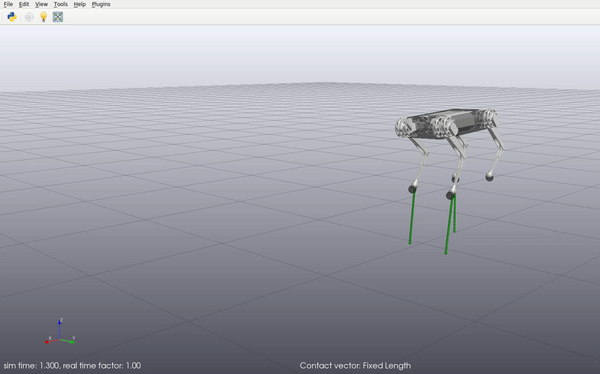

# Quadruped Drake

This repository contains code for the simulation and control of quadruped robots using [Drake](https://drake.mit.edu).



## Dependencies

- [Drake](https://drake.mit.edu), compiled with Python bindings
- [LCM](https://lcm-proj.github.io/)
- [Eigen](http://eigen.tuxfamily.org/)
- [Ipopt](https://projects.coin-or.org/Ipopt)
- [ifopt](https://github.com/ethz-adrl/ifopt)
- [CMake](https://cmake.org/cmake/help/v3.0/)
- [Numpy](https://numpy.org)

## Installation

Clone this repository: `git clone https://github.com/vincekurtz/quadruped_drake.git`

Compile C\+\+ code (includes TOWR and custom LCM bindings for interface with drake):
```
mkdir -p build
cd build
cmake ..
make
```

## Usage

Start the drake visualizer `bazel-bin/tools/drake_visualizer`.

Run the simulation script `./simulate.py`.
